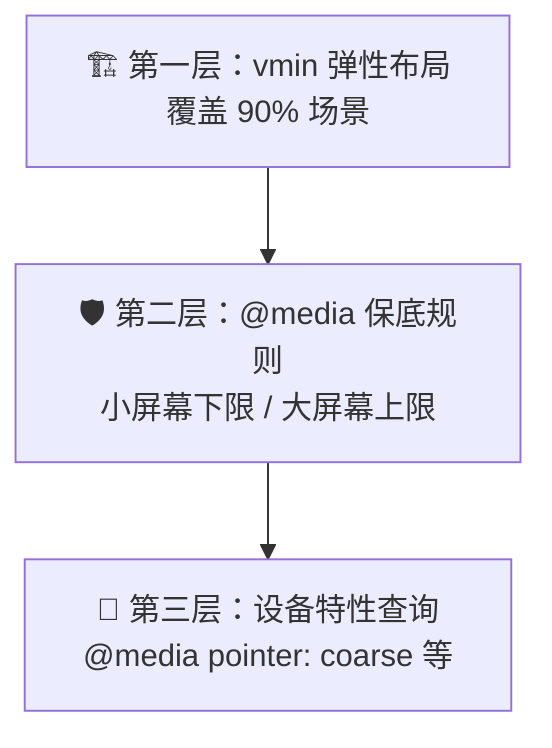

# H5 互动页面 — 开发规范与流程 SOP

> 基于 `h5-demo` 序列播放器项目实战经验总结。适用于：嵌入式 H5 互动页、盲盒/手办展示、小游戏关卡 UI 等场景。

---

## 一、项目架构规范

### 1.1 推荐目录结构

```
project/
├── index.html          # 单入口
├── style.css           # 全局样式（不拆分，减少请求）
├── script.js           # 全局逻辑（IIFE 自执行）
├── config.json         # 数据配置（风格/词语/资源路径）
├── assets/
│   ├── sequences/      # 序列帧素材（按 Style/Word/Variant 分层）
│   ├── icon_*.png      # UI 图标
│   └── exclude.png     # 遮罩层
└── .gitignore
```

### 1.2 技术选型原则

| 决策项 | 选择 | 原因 |
|--------|------|------|
| 框架 | **无框架，原生三件套** | 嵌入 WebView 无需构建工具链，减少体积 |
| CSS 单位 | **`vmin` 为主** | 同一套值自动适配横竖屏 |
| JS 模块化 | **IIFE 闭包** | Chrome 59 不支持 ES Module |
| 图片渲染 | **Canvas 2D** | 序列帧逐帧绘制，性能可控 |
| 音频 | **Audio 元素 + clone** | 比 Web Audio API 兼容性更好 |

---

## 二、CSS 屏幕适配策略

### 2.1 三层金字塔



#### 第一层：`vmin` 弹性布局（核心）

```css
/* ✅ 用 vmin —— 自动取 viewport 宽高中较小值 */
.window-frame { width: 80vmin; }
.finish-btn { font-size: 2.2vmin; padding: 1.5vmin 5vmin; }

/* ❌ 避免 —— px 固定值在不同设备上无法缩放 */
.window-frame { width: 400px; }
```

**为什么是 `vmin` 而不是 `vw`/`vh`?**
- 竖屏时 `vmin = vw`，横屏时 `vmin = vh`
- 一套数值自动适应两个方向，无需写两套媒体查询

#### 第二层：`@media` 保底（兼容）

```css
/* 小屏幕保底：保证文字可读、按钮可点 */
@media (max-width: 480px), (max-height: 480px) {
    .finish-btn { font-size: 14px; padding: 10px 28px; }
    .drag-guide-text { font-size: 10px; }
}
```

> [!IMPORTANT]
> **不要用 `max()`、`clamp()`、`min()` 函数！** Chrome 79 以下不支持。
> 用 `@media` 查询 + 固定值覆盖代替。

#### 第三层：设备特性查询

```css
/* 触屏设备：确保最小触控区域 44px */
@media (pointer: coarse) {
    .control-btn { min-width: 40px; min-height: 40px; }
    .finish-btn { min-height: 44px; }
}
```

### 2.2 适配检查清单

| 检查项 | 目标值 | 原因 |
|--------|--------|------|
| 按钮高度 | ≥ 44px | Apple HIG 最小触控区域 |
| 正文字号 | ≥ 10px | 保证可读性 |
| 标题字号 | ≥ 11px | 保证可读性 |
| `touch-action` | `none` on drag area | 阻止系统级手势 |
| `overflow` | `visible` on parent | 子元素定位超出时不被裁切 |

---

## 三、JavaScript 兼容性红线

### 3.1 语法安全表（Chrome 59 为底线）

| 语法特性 | 最低 Chrome | 可用？ | 替代方案 |
|----------|-------------|--------|----------|
| `let` / `const` | 49 | ✅ | — |
| 箭头函数 `=>` | 45 | ✅ | — |
| 模板字符串 `` ` `` | 41 | ✅ | — |
| `async / await` | 55 | ✅ | — |
| `Promise` | 33 | ✅ | — |
| `Array.from()` | 45 | ✅ | — |
| `Object.entries()` | 54 | ✅ | — |
| 解构赋值 `{a, b}` | 49 | ✅ | — |
| **对象展开 `...obj`** | **60** | ❌ | `Object.assign()` |
| **数组展开 `[...arr]`** | 46 | ✅ | — |
| `Array.includes()` | 47 | ✅ | — |
| 默认参数 `f(x=1)` | 49 | ✅ | `x = x \|\| 1` |
| ES Modules `import` | 61 | ❌ | IIFE 闭包 |
| `globalThis` | 71 | ❌ | `window` |
| 可选链 `?.` | 80 | ❌ | `&&` 短路 |
| 空值合并 `??` | 80 | ❌ | `\|\|` |
| `max()` / `clamp()` CSS | 79 | ❌ | `@media` |

> [!CAUTION]
> **对象展开 `{ ...obj }` 是最容易踩的坑**——数组展开 `[...arr]` 可以用，但对象展开在 Chrome 60 之前会导致 **整个 JS 文件无法解析**（SyntaxError），不是运行时错误而是解析时错误。

### 3.2 事件监听兼容模板

```javascript
// ✅ passive 特性检测（旧安卓 WebView 兼容）
var supportsPassive = false;
try {
    var opts = Object.defineProperty({}, 'passive', {
        get: function() { supportsPassive = true; }
    });
    window.addEventListener('testPassive', null, opts);
    window.removeEventListener('testPassive', null, opts);
} catch (e) {}
var passiveFalse = supportsPassive ? { passive: false } : false;

// 使用
el.addEventListener('touchstart', handler, passiveFalse);
el.addEventListener('touchmove', handler, passiveFalse);
```

---

## 四、开发流程 SOP


### Step 1 — 架构搭建（0.5 天）
- 确定目录结构、资源加载策略
- 搭建 `config.json` 数据驱动结构
- 建立本地 `python -m http.server` 开发环境
- 确定宿主通信协议（PostMessage 格式）

### Step 2 — 核心功能（1-2 天）
- Canvas 序列帧渲染引擎
- 拖拽交互（mouse + touch）
- 资源加载 & 错误回退
- 宿主通信（接收指令 / 发送结果）

### Step 3 — 视觉 & 动画（1 天）
- UI 皮肤 & 主题
- 交互引导动画（手势提示）
- 加载态 & 转场动画
- 音效集成

### Step 4 — 适配 & 兼容（0.5 天）
按照**三层金字塔**策略逐层检查：
1. `vmin` 基础布局是否横竖屏自适应
2. `@media` 小屏保底是否覆盖
3. `touch-action` / `viewport-fit` / `passive` 是否就绪

### Step 5 — 代码审查（见下方清单）

### Step 6 — 设备实测

| 设备 | 分辨率 | 重点检查 |
|------|--------|----------|
| iPhone SE | 320×568 | 文字/按钮是否太小 |
| iPhone 14 | 390×844 | 刘海屏安全区 |
| iPad | 768×1024 | 横竖屏切换 |
| 安卓 Pad | 800×1280 | 触摸拖拽是否被系统手势拦截 |
| Chrome 59 | 桌面 | JS 是否报 SyntaxError |
| 目标 WebView | 嵌入环境 | PostMessage 通信是否正常 |

---

## 五、代码审查清单

每次提交前逐项检查，按 **致命 → 严重 → 建议** 排序：

### 🔴 致命（必须修复）

- [ ] JS 中是否使用了**对象展开 `...obj`**？→ 改 `Object.assign`
- [ ] JS 中是否使用了**可选链 `?.`** 或 **空值合并 `??`**？→ 改 `&&` / `||`
- [ ] JS 中是否使用了 `import/export`？→ 改 IIFE
- [ ] CSS 中是否使用了 `max()` / `clamp()` / `min()`？→ 改 `@media`
- [ ] 页面加载后 Console 是否有 SyntaxError / ReferenceError？

### 🟡 严重（强烈建议）

- [ ] CSS flexbox 是否用了 `gap`？→ 改 `margin`（Chrome 84 以下不支持）
- [ ] 触摸事件是否有 `passive` 特性检测？
- [ ] 拖拽区域是否设置了 `touch-action: none`？
- [ ] `viewport` meta 是否包含 `viewport-fit=cover`？
- [ ] 弹性容器父级 `overflow` 是否为 `visible`（子元素超出不被裁切）？
- [ ] 按钮/可交互元素是否满足 44px 最小触控区域？

### 🟢 建议（提升体验）

- [ ] 文字最小字号是否 ≥ 10px（通过 @media 保底）？
- [ ] 图片加载是否有 fallback（SVG 占位）？
- [ ] 音频播放是否有 `.catch(() => {})` 防止 autoplay 报错？
- [ ] `@supports` 是否用于渐进增强（如 `backdrop-filter`）？
- [ ] 所有可交互元素是否有 `-webkit-tap-highlight-color: transparent`？
